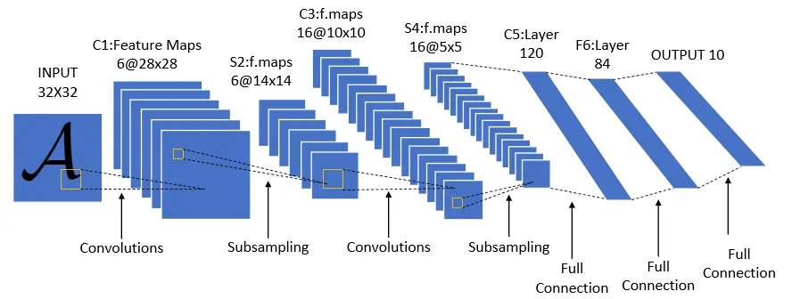
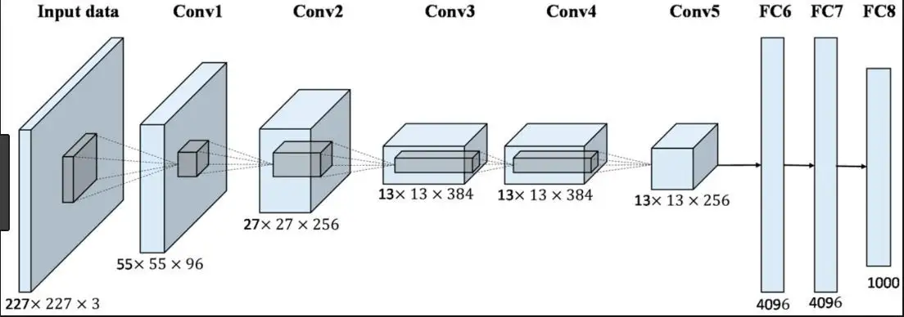
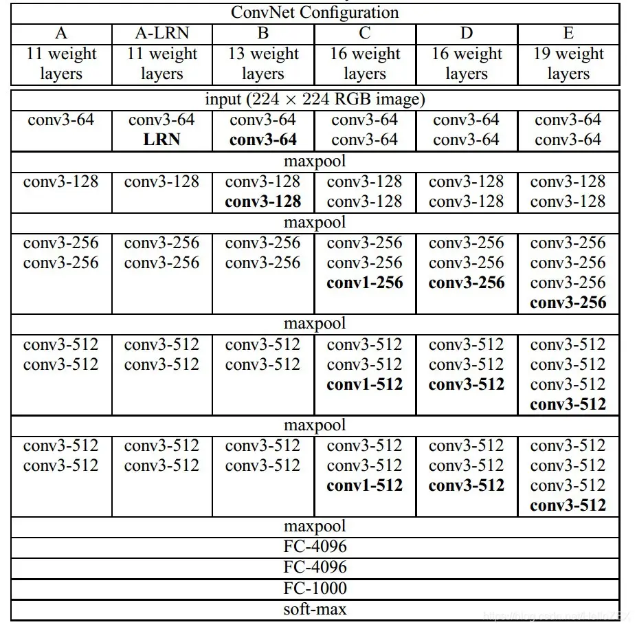
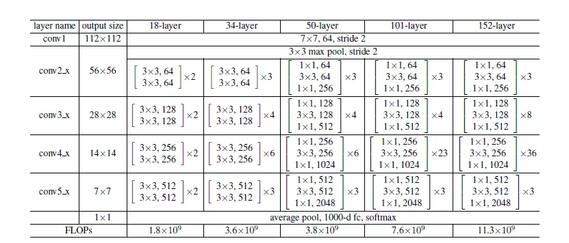
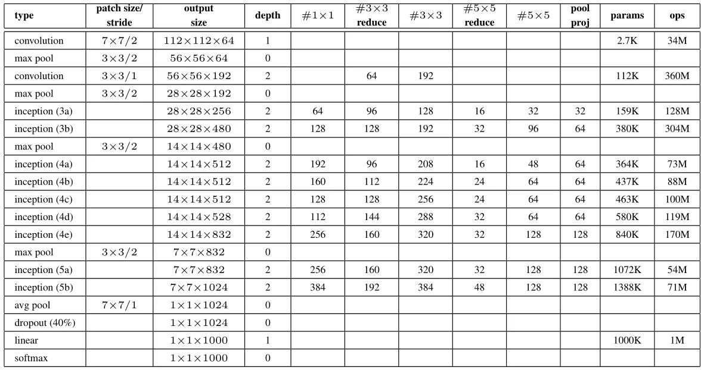

# Simple-CV-Pytorch-master

This code includes detection and classification tasks in Computer Vision, and semantic segmentation task will be added
later.

For classification, I reproduced LeNet5, VGG16, AlexNet, ResNet. Then I will reproduce GoogLeNet, ResNetXt, MobileNet,
ShuffleNet, EiffcientNet, etc.

For object detection, I reproduced RetinaNet. (I broke the code up into modules, such as backbones, necks, heads,
loss,etc.
This makes it easier to modify and add code.) Of course, other object detection algorithms will be added later.

Detailed explanation has been published on CSDN and Quora(Chinese) Zhihu.

[CSDN](https://blog.csdn.net/xiaoyyidiaodiao/category_11888930.html?spm=1001.2014.3001.5482)

[Quora(Chinese)Zhihu](https://www.zhihu.com/column/c_1523732135009198080)

You should create **checkpoint**(model save), **log**, **results** and **tenshorboard**(loss visualization) file
package.

## Compiling environment

Install requirements with pip (you can put requirements.txt to venv/Scripts/, if you need it.)

```
pip install -r requirements.txt
```

```
python == 3.9.12

torch == 1.11.0+cu113

torchvision== 0.11.0+cu113

torchaudio== 0.12.0+cu113

pycocotools == 2.0.4

numpy

Cython

matplotlib

opencv-python 

skimage

tqdm

thop
```

## Dataset Path

Please, watch FolderOrganization.txt ( There are more details. )

## Folder Organization

```

I use Ubuntu20.04 (OS).

project path: /data/PycharmProject

Simple-CV-master path: /data/PycharmProject/Simple-CV-Pytorch-master
|
|----checkpoints ( resnet50-19c8e357.pth \COCO_ResNet50.pth[RetinaNet]\ VOC_ResNet50.pth[RetinaNet] )
|
|            |----cifar.py （ null, I just use torchvision.datasets.ImageFolder ）
|            |----CIAR_labels.txt
|            |----coco.py
|            |----coco_eval.py
|            |----coco_labels.txt
|----data----|----__init__.py
|            |----config.py ( path )
|            |----imagenet.py ( null, I just use torchvision.datasets.ImageFolder )
|            |----ImageNet_labels.txt
|            |----voc0712.py
|            |----voc_eval.py
|            |----voc_labels.txt
|                                     |----crash_helmet.jpg
|----images----|----classification----|----sunflower.jpg
|              |                      |----photocopier.jpg
|              |                      |----automobile.jpg
|              |
|              |----detection----|----000001.jpg
|                                |----000001.xml
|                                |----000002.jpg
|                                |----000002.xml
|                                |----000003.jpg
|                                |----000003.xml
|
|----log(XXX[ detection or classification ]_XXX[  train or test or eval ].info.log)
|
|              |----__init__.py
|              | 
|              |              |----__init.py
|              |----anchor----|----RetinaNetAnchors.py
|              |
|              |               |----lenet5.py
|              |               |----alexnet.py
|              |----basenet----|----vgg.py
|              |               |----resnet.py
|              |               |----googlenet.py    
|              |
|              |                 |----DarkNetBackbone.py
|              |----backbones----|----__init__.py ( Don't finish writing )
|              |                 |----ResNetBackbone.py
|              |                 |----VovNetBackbone.py
|              |                 
|              |                 
|              |
|----models----|----heads----|----__init.py
|              |             |----RetinaNetHeads.py
|              |
|              |              |----RetinaNetLoss.py      
|              |----losses----|----__init.py
|              |
|              |             |----FPN.py
|              |----necks----|----__init__.py
|              |             |-----FPN.txt
|              |
|              |----RetinaNet.py
|
|----results ( eg: detection ( VOC or COCO AP ) )
|
|----tensorboard ( Loss visualization )
|
|----tools                       |----eval.py
|         |----classification----|----train.py
|         |                      |----test.py
|         |               
|         |               
|         |
|         |                 |----eval_coco.py
|         |                 |----eval_voc.py
|         |----detection----|----test.py
|                           |----train.py
|                      
|
|             |----AverageMeter.py
|             |----BBoxTransform.py
|             |----ClipBoxes.py
|             |----Sampler.py 
|             |----iou.py            
|----utils----|----__init__.py
|             |----accuracy.py
|             |----augmentations.py
|             |----collate.py
|             |----get_logger.py
|             |----nms.py
|             |----path.py
|
|----FolderOrganization.txt
|
|----main.py
|
|----README.md
|
|----requirements.txt

```

## Run the program

### 1.classification

- Reproduce network architectures

  1).ResNetXt

  2).MobileNet

  3).ShuffleNet

  4).EfficientNet

  (They should be placed in backbone of object detection, but they are used to extract features, just like
  classification networks)

  1).DarkNet

  2).VovNet

  (finished)

**1).LeNet5(models/basenets/lenet5.py)**[1]

```
 I add nn.BatchNorm2d(). This is because that I was so upset about the poor accuracy.
 basenet: lenet5 (image size: 32 * 32 * 3)
 dataset: cifar
 len(dataset): 50000, iter_size: 1562 
 batch_size: 32
 optim: SGD
 scheduler: MultiStepLR
 milestones: [15, 20, 30]
 weight_decay: 1e-4
 gamma: 0.1
 momentum: 0.9
 lr: 0.01
 poch: 30
 ```



|  epoch  |   times    | top1 acc (%) | top5 acc (%) |
|:-------:|:----------:|:------------:|:------------:|
|    0    | 0h0min23s  |    50.00     |    93.75     |
|    1    | 0h0min21s  |    62.50     |    96.88     |
|    2    | 0h0min24s  |    65.62     |    96.88     |
|    3    | 0h0min21s  |    53.12     |    96.88     |
|   ...   |    ...     |     ...      |     ...      |
|   29    | 0h0min23s  |    75.00     |    100.00    |

Total:

| epochs |   times   |   avg top1 acc (%)    |  avg top5 acc (%)  |
|:------:|:---------:|:---------------------:|:------------------:|
|   30   | 0h11m44s  |  62.208533333333335   | 95.97033333333333  |

**2).AlexNet(models/basenets/alexnet.py)**[2]

```
 I add nn.BatchNorm2d(). This is because that I was so upset about the poor accuracy.
 basenet: AlexNet (image size: 224 * 224 * 3)
 dataset: cifar
 len(dataset): 50000, iter_size: 1562 
 batch_size: 32
 optim: SGD
 scheduler: MultiStepLR
 milestones: [15, 20, 30]
 weight_decay: 1e-4
 gamma: 0.1
 momentum: 0.9
 lr: 0.01
 epoch: 30
 ```



|  epoch  |   times   | top1 acc (%) | top5 acc (%) |
|:-------:|:---------:|:------------:|:------------:|
|    0    | 0h0min45s |    50.00     |    90.62     |
|    1    | 0h0min44s |    62.50     |    93.75     |
|    2    | 0h0min46s |    68.75     |    96.88     |
|    3    | 0h0min44s |    62.50     |    100.00    |
|   ...   |    ...    |     ...      |     ...      |
|   29    | 0h0min42s |    100.00    |    100.00    |

Total:

| epochs |  times   |   avg top1 acc (%)   |  avg top5 acc (%)  |
|:------:|:--------:|:--------------------:|:------------------:|
|   30   | 0h22m44s |  86.27453333333334   | 98.99946666666666  |

**3).VGG(models/basenets/vgg.py)**[3]

```
 I add nn.BatchNorm2d() and transfer learning. This is because that I was so upset about the poor accuracy.
 basenet: vgg16 (image size: 224 * 224 * 3)
 dataset: cifar
 len(dataset): 50000, iter_size: 1562 
 batch_size: 32
 optim: SGD
 scheduler: MultiStepLR
 milestones: [15, 20, 30]
 weight_decay: 1e-4
 gamma: 0.1
 momentum: 0.9
 lr: 0.01
 epoch: 30
 ```



|  epoch  |   times   | top1 acc (%) | top5 acc (%) |
|:-------:|:---------:|:------------:|:------------:|
|    0    | 0h2min46s |    25.00     |    71.88     |
|    1    | 0h2min45s |    53.12     |    87.50     |
|    2    | 0h2min44s |    40.62     |    96.88     |
|    3    | 0h2min42s |    34.38     |    90.62     |
|   ...   |    ...    |     ...      |     ...      |
|   29    | 0h2min44s |    100.00    |    100.00    |

Total:

| epochs |  times   |   avg top1 acc (%)   | avg top5 acc (%) |
|:------:|:--------:|:--------------------:|:----------------:|
|   30   | 1h23m43s |  76.55606666666667   |      96.441      |

**4).ResNet(models/basenets/resnet.py)**[4]

```
 basenet: resnet18 
 dataset: ImageNet
 batch_size: 32
 optim: SGD
 scheduler: MultiStepLR
 milestones: [15, 20, 30]
 weight_decay: 1e-4
 gamma: 0.1
 momentum: 0.9
 lr: 0.001
 epoch: 30
```



| epoch |   times    | top1 acc (%) | top5 acc (%) |
|:-----:|:----------:|:------------:|:------------:|
|   0   | 4h22min38s |    28.12     |    43.75     |
|   1   | 3h59min35s |    34.38     |    59.38     |
|   2   | 3h48min0s  |    65.62     |    84.38     |
|   3   | 3h48min56s |    46.88     |    75.00     |
|   4   | 3h54min36s |    53.12     |    75.00     |
|   5   | 3h49min35s |    56.25     |    71.88     |

**5).GoogLeNet(models/besenets/googlenet.py)**[5]

```
 basenet: GoogLeNet 
 dataset: ImageNet
 batch_size: 32
 optim: SGD
 scheduler: MultiStepLR
 milestones: [15, 20, 30]
 weight_decay: 1e-4
 gamma: 0.1
 momentum: 0.9
 lr: 0.01
 epoch: 30
```



| epoch |   times    | top1 acc (%) | top5 acc (%) |
|:-----:|:----------:|:------------:|:------------:|
|   0   | 4h37min18s |    43.75     |    59.38     |
|   1   | 3h57min13s |    37.50     |    65.62     |
|   2   | 3h59min38s |    56.25     |    78.12     |
|   3   | 3h55min23s |    46.88     |    65.62     |
|   4   | 3h55min45s |    50.00     |    75.00     |
|   5   | 3h49min35s |    56.25     |    71.88     |

- Run

```
#!/bin/bash
conda activate base
python /data/PycharmProject/Simple-CV-Pytorch-master/tools/classification/XXX.py(train.py or eval.py or test.py)
```

### 2.object detection

- Reproduce network architectures

  1).SSD

  2).Faster RCNN

  3).YOLO

  (finished)

  1.RetinaNet(models/RetinaNet.py)

- Run

```
#!/bin/bash
conda activate base
python /data/PycharmProject/Simple-CV-Pytorch-master/tools/detection/XXX.py(train.py or eval_coco.py or eval_voc.py or test.py)
```

### 3.semantic segmentation

- Reproduce network architectures

  1.FCN

  2.DeepLab

  3.U-Net

## references

[[1] LeCun Y, Bottou L, Bengio Y, et al. Gradient-based learning applied to document recognition[J]. Proceedings of the IEEE, 1998, 86(11): 2278-2324.](https://www.researchgate.net/publication/2985446_Gradient-Based_Learning_Applied_to_Document_Recognition)

[[2] Krizhevsky A, Sutskever I, Hinton G E. Imagenet classification with deep convolutional neural networks[J]. Advances in neural information processing systems, 2012, 25.](https://proceedings.neurips.cc/paper/2012/file/c399862d3b9d6b76c8436e924a68c45b-Paper.pdf)

[[3] Simonyan K, Zisserman A. Very deep convolutional networks for large-scale image recognition[J]. arXiv preprint arXiv:1409.1556, 2014.](https://arxiv.org/pdf/1409.1556.pdf%E3%80%82)

[[4] He K, Zhang X, Ren S, et al. Deep residual learning for image recognition[C]//Proceedings of the IEEE conference on computer vision and pattern recognition. 2016: 770-778.](https://arxiv.org/abs/1512.03385)

[[5] Szegedy C, Liu W, Jia Y, et al. Going deeper with convolutions[C]//Proceedings of the IEEE conference on computer vision and pattern recognition. 2015: 1-9.](https://sci-hub.wf/10.1109/cvpr.2015.7298594)

